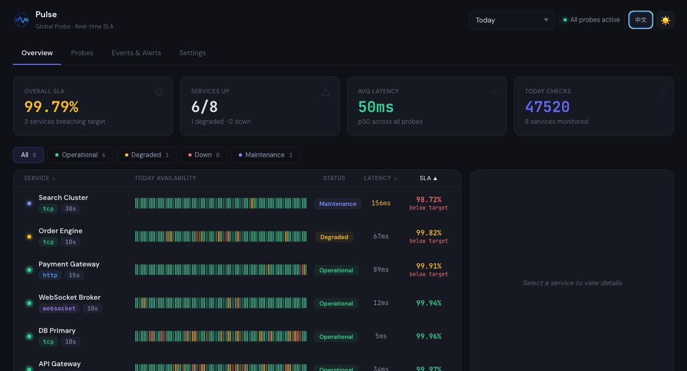
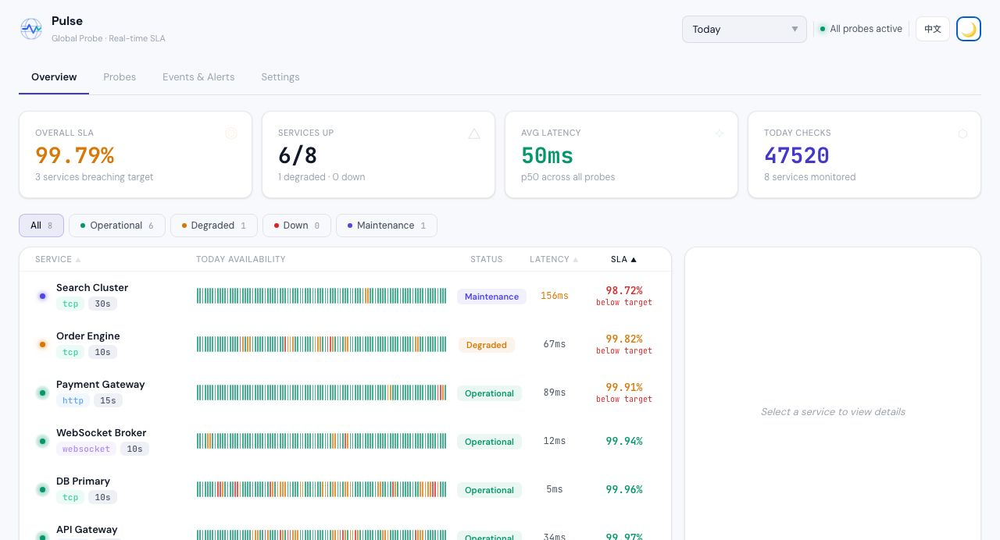
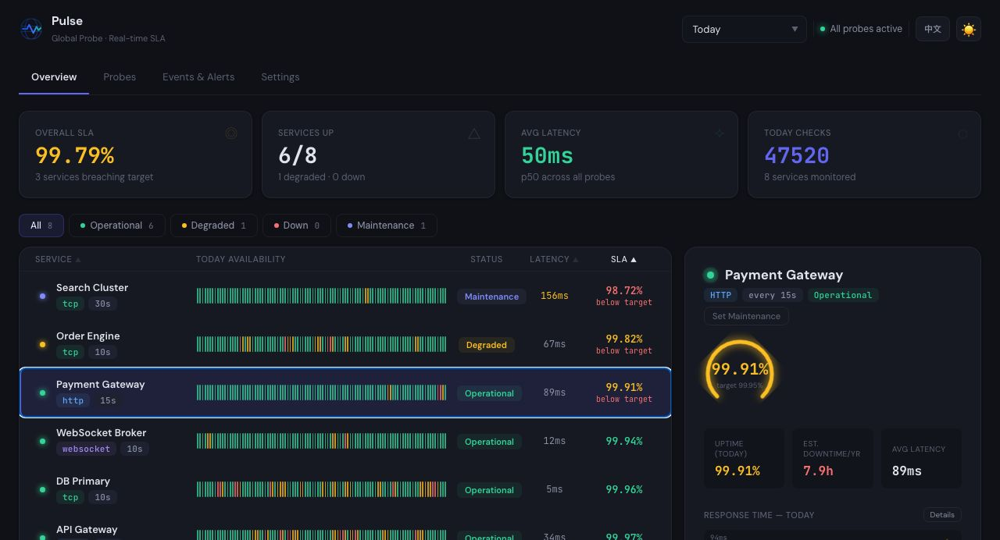

<div align="center">

# Pulse

**Lightweight SLA Monitoring Platform with Global Probes**

[](https://go.dev)
[](https://react.dev)
[](https://www.typescriptlang.org)
[](LICENSE)

[English](README.md) | [中文](README_CN.md)



</div>

---

Pulse is a self-hosted uptime monitoring and SLA tracking platform. Deploy lightweight probes across global regions, monitor services via HTTP, TCP, WebSocket, DNS, ICMP, or client-side heartbeat, and get real-time availability dashboards with incident history.

## Screenshots

| Dark Theme | Light Theme |
|:---:|:---:|
|  |  |

| Service Detail Panel |
|:---:|
|  |

## Features

- **Multi-Protocol Monitoring** — HTTP(S), WebSocket, TCP, DNS, ICMP, and Client Push (heartbeat)
- **Global Probe Deployment** — Distribute probes across CN (Zhangjiakou / Shenzhen / Shanghai), Hong Kong, Southeast Asia, Europe, US East / US West
- **Real-Time SLA Dashboard** — Live availability %, latency (p50/p95/p99), uptime charts, and incident timeline
- **Service-Level SLA Targets** — Set SLA goals per service, with configurable reporting windows (rolling 7D–365D)
- **Maintenance Windows** — Suppress alerts and exclude downtime from SLA calculations during planned maintenance
- **Incident Tracking** — Automatic detection of status transitions (up / degraded / down) with duration and recovery logs
- **Webhook Alerts** — Configurable anomaly notifications to Slack, DingTalk, Feishu, or any webhook endpoint
- **Dark / Light Themes** — Polished UI with theme toggle, designed for both desktop and mobile
- **i18n** — Full English and Chinese localization
- **PWA Support** — Installable as a Progressive Web App with offline caching
- **Single Binary Deploy** — Go server embeds the SPA; runs anywhere as one binary
- **API Key Auth** — Secure API access with key regeneration and 24-hour grace period

## Architecture

```
┌─────────────────────────────────────────────────────────┐
│                    Browser (React SPA)                   │
│         Dashboard · Probes · Settings · Incidents        │
└──────────────────────────┬──────────────────────────────┘
                           │ REST API
┌──────────────────────────▼──────────────────────────────┐
│                   Go API Server (Echo)                   │
│            SQLite · Probe Scheduler · Alerting           │
└──────┬───────────────────────────────────┬──────────────┘
       │                                   │
  ┌────▼─────┐                       ┌─────▼────┐
  │  Active   │                       │  Client  │
  │  Probes   │                       │   Push   │
  │ HTTP/TCP/ │                       │ (pulse-  │
  │ WS/DNS/  │                       │  probe)  │
  │  ICMP     │                       │          │
  └──────────┘                       └──────────┘
       │                                   │
  Global Regions:                    IoT / Internal
  CN · HK · SEA · EU · US           Services
```

## Quick Start

### Prerequisites

- [Node.js](https://nodejs.org) 24+ (managed via [mise](https://mise.jdx.dev))
- [Go](https://go.dev) 1.23+
- [pnpm](https://pnpm.io) 10+

### Development

```bash
# Install dependencies
pnpm install

# Start frontend (port 3000) + Go server (port 7758) concurrently
pnpm dev

# Run all tests (web + server + probe)
pnpm test

# Lint + typecheck + test + build
pnpm verify
```

### Production Build

```bash
# Build frontend SPA + Go server binary
pnpm build

# Build standalone probe collector
pnpm build:probe
```

## Deployment

### Docker

```bash
docker compose up -d
```

### Docker (manual)

```bash
docker build -t pulse .
docker run -p 3000:3000 pulse
```

### Fly.io

```bash
pnpm ship   # deploys to Fly.io
```

### Standalone Binary

Build the Go server with embedded SPA and run it directly — no Node.js required in production.

## Project Structure

```
packages/
  web/          React 19 + Vite 6 SPA (TypeScript, inline styles)
  server/       Go API server (Echo v4, SQLite)
  probe/        Standalone probe collector binary (pulse-probe)
```

## Tech Stack

| Layer | Technology |
|-------|-----------|
| Frontend | React 19, Vite 6, TypeScript |
| Backend | Go 1.23, Echo v4, SQLite |
| Styling | Inline CSS, DM Sans + JetBrains Mono + Space Grotesk |
| Linting | Biome |
| Testing | Vitest (web), Go test (server + probe) |
| CI/CD | GitHub Actions |
| Deploy | Docker, Fly.io, standalone binary |

## API Documentation

See [SWAGGER_OPENAPI.md](SWAGGER_OPENAPI.md) for the full REST API reference with request/response examples.

## Contributing

Contributions are welcome! Please:

1. Fork the repository
2. Create a feature branch (`git checkout -b feat/amazing-feature`)
3. Run `pnpm verify` before committing
4. Submit a Pull Request

## License

[Apache License 2.0](LICENSE)

---

<div align="center">
  <sub>Built with Go + React for reliable service monitoring.</sub>
</div>
